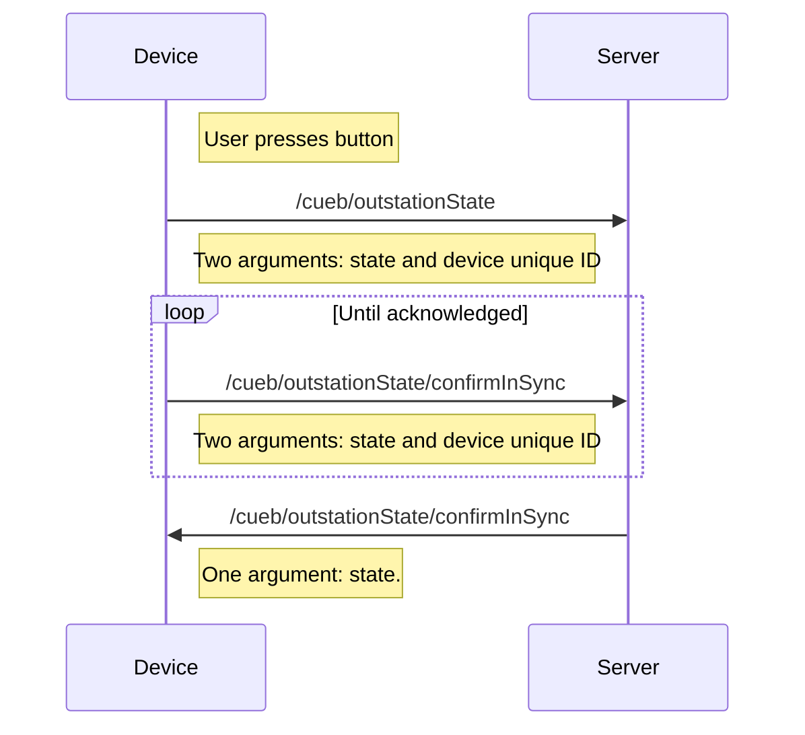
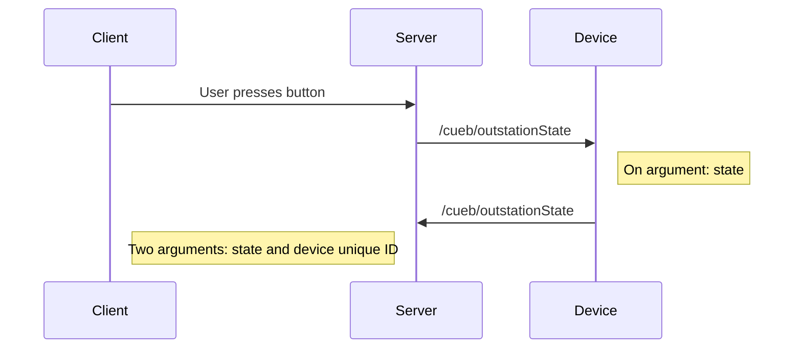
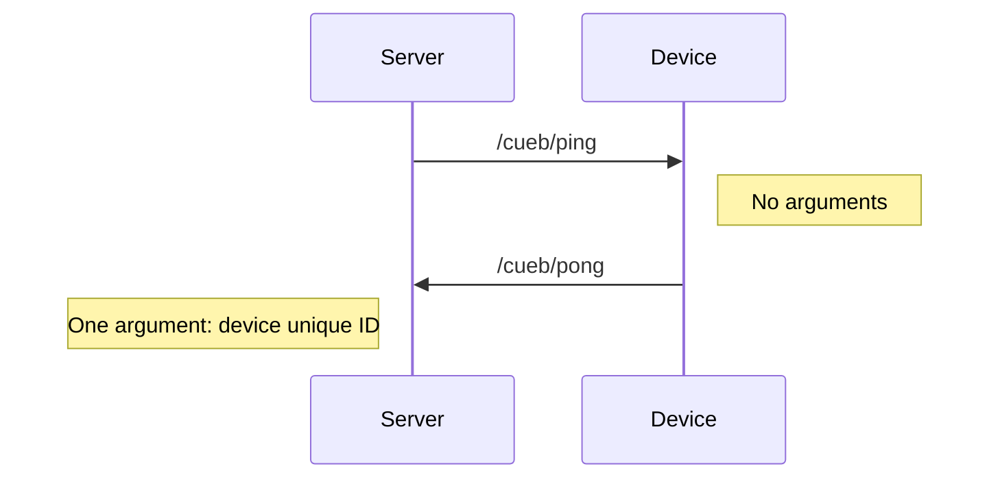

# CueB Gen 2 - version 8 onwards

This is the code for the CueB Gen 2. It is a different architecture to [Gen 1](https://github.com/bstudios/CueB/tree/Gen1), and is based on networked outstations which are W5500 EVB Raspberry Pi Pico boards from Wiznet.

The code is split into three parts:

- `device` - the code that runs on the Pico, in Micropython
- `server` - an electron app, which serves a web interface and communicates with the devices
- `client` - a React web interface, which is served by the server

## Communication with Devices

Communication between the server and the devices is over OSC. Only one server can exist within a given subnet, as the devices rely on keeping track of what they think the server's state is.

### Device States

Each individual device is responsible for managing its own state, and the server communicates with each devices to confirm its state.

There are two ways of changing the state of a device. Devices always boot with a state of 1.

| State Number | State Name             | Red Button LED 🔴 | Green Button LED 🟢 | Remarks                                       |
| ------------ | ---------------------- | ----------------- | ------------------- | --------------------------------------------- |
| 0            | Error                  |                   |                     | Device boots in this state                    |
| 1            | Ready                  |                   |                     | Device is idle                                |
| 2            | Unacknowledged Standby | ⚡                |                     | DSM is waiting for acknowledgement of standby |
| 3            | Acknowledged Standby   | 🔴                |                     | Outstation has acknowledged                   |
| 4            | Unacknowledged Go      |                   | ⚡                  | (not used)                                    |
| 5            | Acknowledged Go        |                   | 🟢                  | Will auto-reset after configured time         |
| 6            | Panic/Vegas            | 🔴                | 🟢                  | User trying to get attention of DSM           |
| 7            | Identify/Flash         | ⚡                | ⚡                  | To identify an outstation                     |

### Device changes own state

If a user presses a button on a device, this will change its state. The device will then broadcast its new state to the server, which will confirm it.

### Server changes device state

The server can send a message to change a device's state. The device will confirm that it has received the new state.

### Ping/Pong messages

The server can send a ping message to the device, which will reply with a pong message. This is used to check if the device is still connected to the network.

### Determining the state of a device

The server can, at any time, ask a device to transmit its state.

## Updating

- Bump package.json version for client & server
- Commit to gen2 branch and push
- Create and publish a new release
- (Github action will add files to release)

## Device status lights

| LED State | Color | Status                                              |
| --------- | ----- | --------------------------------------------------- |
| On        | 🔴    | Connected to network, and has IP                    |
| On        | 🟡    | Received message from server in last 5 seconds      |
| Flashing  | 🔴    | Disconnected from network                           |
| Flashing  | 🟡    | No messages received from server in last 10 seconds |
| Off       | 🔴    | No network                                          |
| Off       | 🟡    | No messages received from server in last 10 minutes |

## Tracking deployed devices

List of devices produced is in the wiki: https://github.com/bstudios/CueB/wiki
