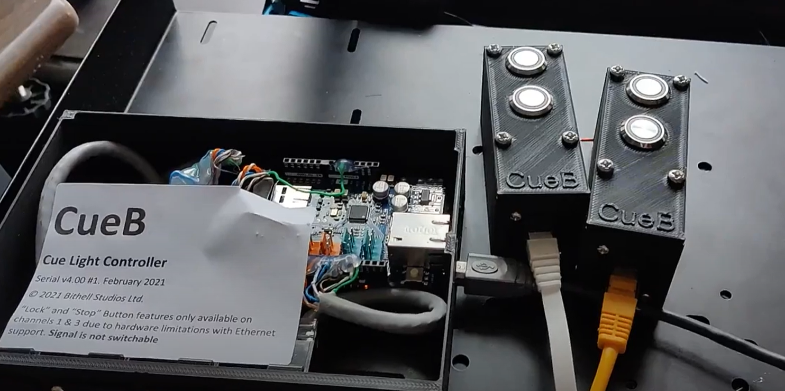
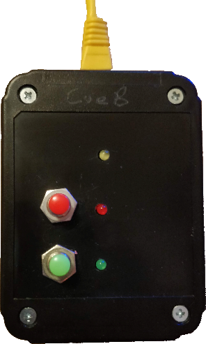
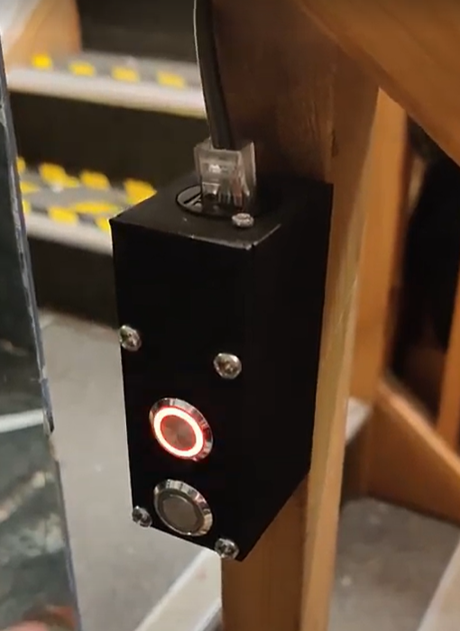
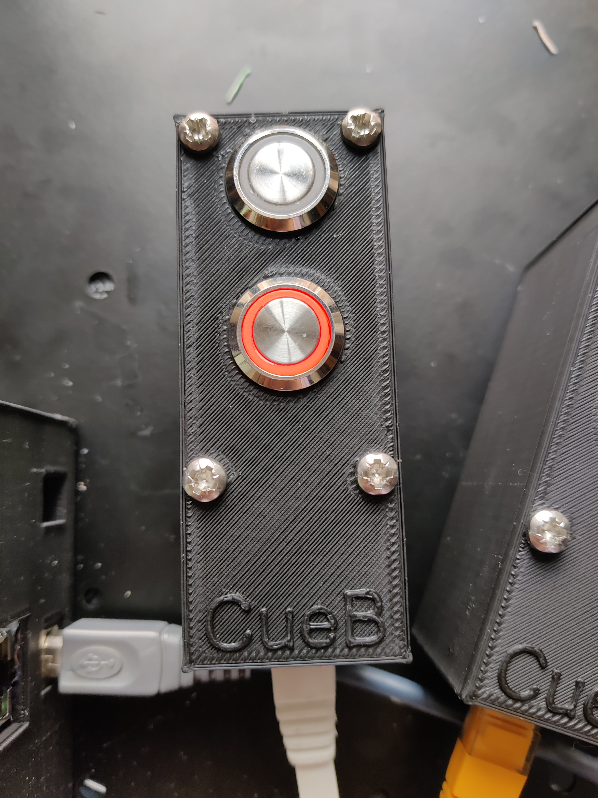
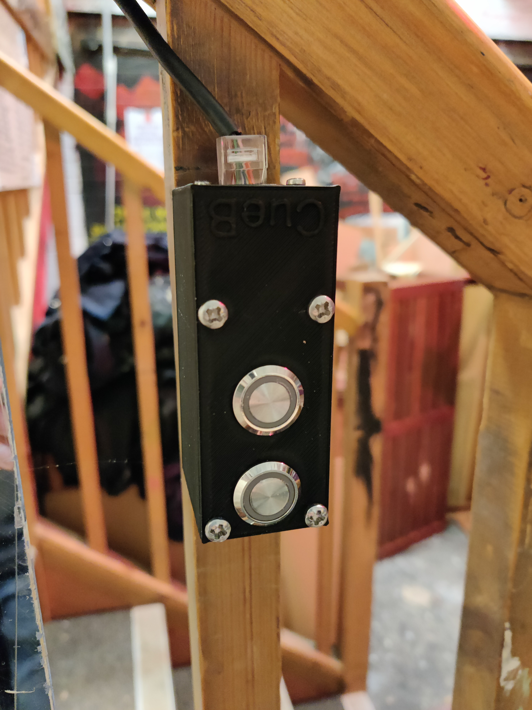

# Devices
## Controllers
### Table of features

| Generation | Master standby | Master go | LCD | Indicator lights | Cue programming | USB Link | Socket for Network |
| --- | --- | --- | --- | --- | --- | --- | --- |
| [v1.2](#v12) | ✓ | ✓ |  |  |  |  |
| [v2](#v2) |  | ✓ | ✓ | ✓ |  | ✓ |  |
| [v3](#v3) |  |  |  |  |  | ✓ |  |
| [v4](#v4) |  |  |  |  |  | ✓ | ✓ |

### v1.2

*Built January 2018 for Westminster School Production of Cabaret*

.jpg)

.jpg)

### v2

*Built June-September 2019 as prototype*
.jpg)

.jpg)

### v3

| | |
|---|---|
| Number produced | 1 |
| Still in production? | No |
| Dates of production | December 2018 |
| Notes | *Design produced for University of York DramaSoc* | 

| Serial Number | Date finished | Remarks |
|---|---|---|
| v3.0C #1 | 1 December 2018 | For University of York DramaSoc.  |

### v4

| | |
|---|---|
| Number produced | 1 |
| Still in production? | On Request |
| Dates of production | February 2021 |
| Notes | *Design produced for University of York DramaSoc* | 

| Serial Number | Date finished | Remarks |
|---|---|---|
| v4.00 #1 | 11 February 2021 | For University of York DramaSoc. Channel 4 lock status is faulty, Channel 2 key switch & 3rd button is disabled, due to hardware constraints. |

## Outstatations
### Table of features

| Generation | Standby Light | Go Light | 3rd Facepanel light | ACK Button | Go Button | Key Switch | Emergency Stop | 3rd Facepanel Button | Light up GO Button | Light up ACK Button |
| --- | --- | --- | --- | --- | --- | --- | --- | --- | --- | --- |
| [v1.2](#v12-1) | ✓ |  ✓ |  | ✓ |   |   |  |  | ✓  |  ✓ | 
| [v2](#v2-1) | |  |  |  |   |   |  |  |  |  | 
| [v3](#v3-1) | ✓ |   ✓ |  | ✓ |  | ✓  | ✓ |  |  | ✓ | 
| [v4](#v4)  | ✓ |  ✓ | ✓ | ✓ |  ✓ |  | |  ✓ |  | | 
| [v5](#v5)  | ✓ |  ✓ | ✓ | ✓ |  ✓ |  ✓ | |  ✓ |  | | 
| [v6](#v6)  | ✓ |  ✓ | | ✓ |  ✓ |  | | ✓ | | | 
| [v7](#v7)  | | | | ✓ |  ✓ |  | | ✓ | ✓ | ✓ | 

### v1.2

| | |
|---|---|
| Number produced | 2 |
| Still in production? | No |
| Dates of production | January 2018 |
| Notes | Designed and used for Westminster School's production of Cabaret February 2018 |

.jpg)

.jpg)

### v2

| | |
|---|---|
| Number produced | 0 |
| Still in production? | No |
| Dates of production | |
| Notes | *Details unknown - designed to be built with arcade buttons but never actually produced* |

### v3

| | |
|---|---|
| Number produced | 1 |
| Still in production? | No |
| Dates of production | July 2018 |
| Notes | *Modified from timekeeper project, still backwards compatible* |

.jpg)

.jpg)

### v4

| | |
|---|---|
| Number produced | 3 |
| Still in production? | No |
| Dates of production | December 2018 |
| Notes | *Portable design produced for University of York DramaSoc* | 

| Serial Number | Date finished | Remarks |
|---|---|---|
| v4.0 #1 | 1 December 2018 | For University of York DramaSoc |
| v4.0 #2 | 1 December 2018 | For University of York DramaSoc |
| v4.0 #3 | January 2019 |  |
| v4.0 #4 | October 2019 |  |

### v5

| | |
|---|---|
| Number produced | 2 |
| Still in production? | No |
| Dates of production | December 2018 |
| Notes | *Fixed design produced for University of York DramaSoc* | 

| Serial Number | Date finished | Remarks |
|---|---|---|
| v5.0 #1 | 1 December 2018 | For University of York DramaSoc |
| v5.0 #2 | 1 December 2018 | For University of York DramaSoc |

.jpg)

.jpg)

### v6

| | |
|---|---|
| Number produced | 1 |
| Still in production? | No |
| Dates of production | October 2019 |
| Notes | *Twin port combined for operating QLab/Multiplay from same panel* | 

| Serial Number | Date finished | Remarks |
|---|---|---|
| v6.0 #1 | October 2019 |  |

.jpg)

.jpg)

### v7

| | |
|---|---|
| Number produced | 2 |
| Still in production? | On request |
| Dates of production | February 2021 |
| Notes | | 

| Serial Number | Date finished | Remarks |
|---|---|---|
| v7.0 #1 | February 2021 | For University of York DramaSoc |
| v7.0 #2 | February 2021 | For University of York DramaSoc |

